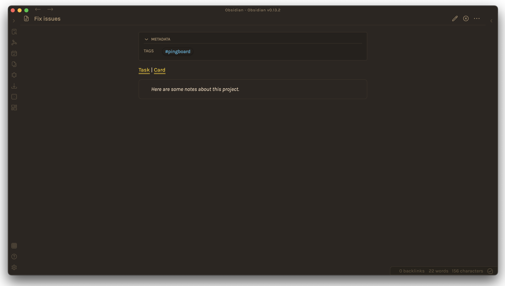
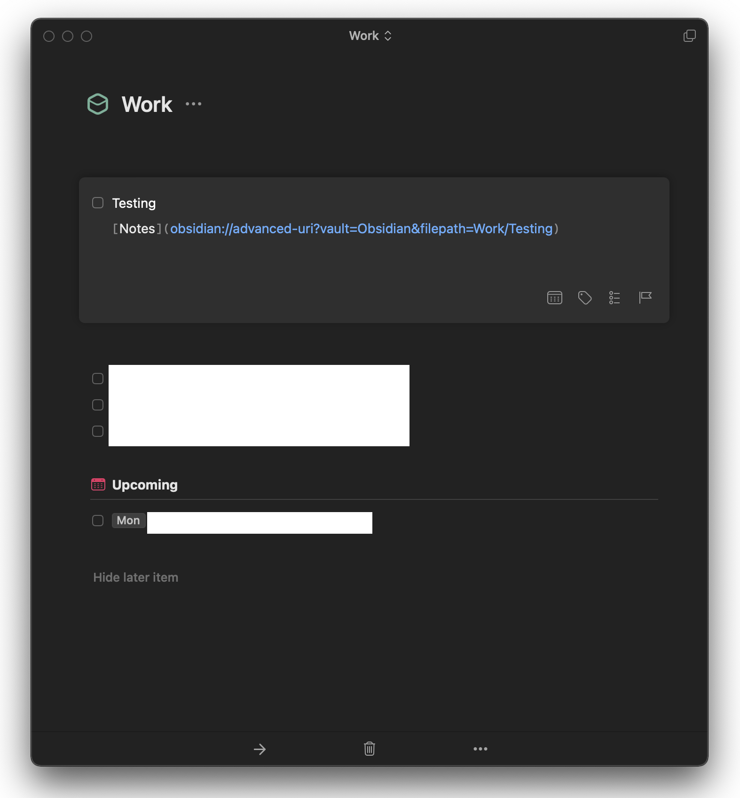

We use [Trello](https://trello.com) to track projects at work. I like to keep track of my own tasks in [Things](https://culturedcode.com/things/), and I like to keep notes and research for my projects in [Obsidian](https://obsidian.md/community). It can be hard to keep all three references to a single project in sync, so I wrote a little shortcut that lives in my menu bar and lets me take a card from Trello and set up a project in Obsidian and Things.

When you run the shortcut, it pulls the latest cards from your preferred Trello list for you to choose from. Once you select a project to set up, it creates a task in Things, which links to the Obsidian note for the project, as well as a note in Obsidian which links to both the original Trello card and the Things task.

Here are examples of the resulting Obsidian note:

And Things task:

This shortcut lets me navigate directly to the same project in all three systems, which makes it easier to keep information flowing between them.

[You can download the shortcut here](https://www.icloud.com/shortcuts/1ad5bd45fcfb4352939c20ce6a653384) to use as a starting place for a similar system. The shortcut makes use of the [Advanced Obsidian URI plugin](https://github.com/Vinzent03/obsidian-advanced-uri), which adds useful actions to Obsidian's URI scheme, so you'll need to have that installed in Obsidian for it to work correctly. Reach out to me with tips or questions! I'm looking forward to further exploring the intersection of automation and Obsidian.
