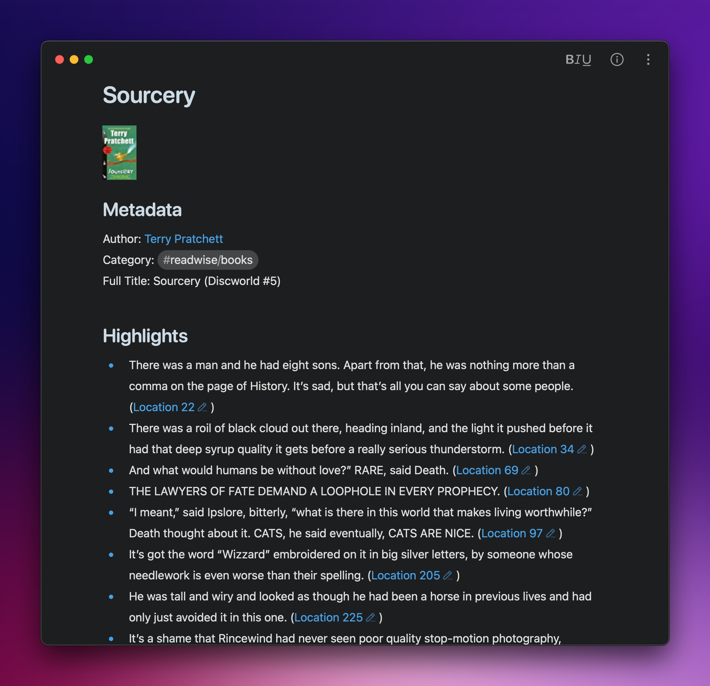

For the past several months, I've been using the [beta version of Bear 2](https://beta.bear.app/t/the-bear-2-beta-is-here/9115) as my note-taking app. I've tried many similar apps over the years (and months), but Bear 2 is currently my favorite. This post isn't about picking a note-taking app, though.

I read a majority of my books on my Kindle. Even though I mostly read fiction, I still find it useful to have my highlights easily accessible, so I sync them to [Readwise](https://readwise.io). The service handles getting my highlights, but while it can export them to some of the more advanced knowledge-management apps, Bear is not supported. Readwise has a markdown export option, but I wanted something more automated, so I built a shortcut called Sync Readwise to Bear.

You can download the shortcut [here](https://www.icloud.com/shortcuts/44fab0b31b424fd4a9559003b1cae8ac). When you download it, it will ask you for your Readwise API token, which you can view [here](https://readwise.io/access_token). On first run, the shortcut will sync all of your existing Readwise highlights to Bear. It will make one note for each Readwise item which has at least one highlight. Once it's done, it will store the current time to a file in the Shortcuts iCloud directory, so that it can sync only your latest highlights in the future.

Here's an example note for Terry Pratchett's [*Sourcery*](https://bookshop.org/p/books/sourcery-terry-pratchett/454117?ean=9780062225726):

As you can see, the note includes a cover image, the item's author and full title, as well as the category of the item as a tag. Because Bear supports nested tags, I can keep all my Readwise highlights in one spot, while still differentiating between articles and books. Each highlight ends with a link its Readwise URL. If you want to customize the formatting of the highlights, you can do so by editing the shortcut.
