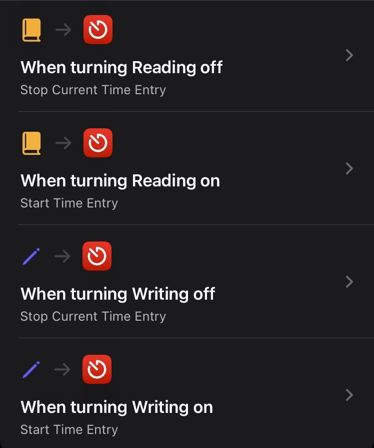
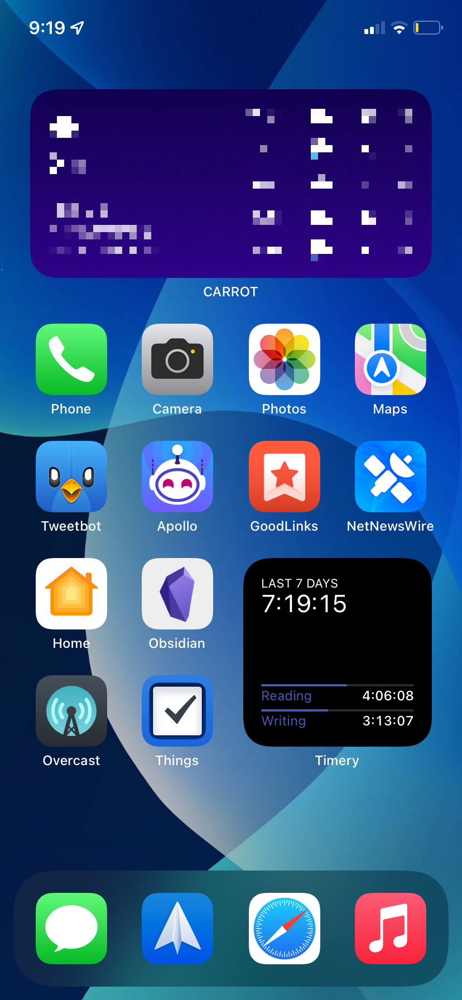

As part of my yearly theme, I wanted to start tracking how much time I was spending on the things I wanted to be: reading and writing.

The requirements:

- [Timery](https://timeryapp.com), a front-end for [Toggl](https://toggl.com)
- A focus mode for what you want to track
- A Timery timer for what you want to track

As always with time tracking, the key is to make starting and stopping timers as frictionless as possible. I achieve this with personal automations in Shortcuts.

When I start reading, I turn on the Reading focus on my phone.[^1] The focus mode starts the saved timer in Timery. When I'm done reading, all I have to do is remember to turn off the focus mode. It's easy to remember as the focus modes also change my homescreen to one with only relevant apps on it.

The final piece is the Timery widget which sits in the lower right hand corner of my home screen and keeps a running total of how long I've spent on reading and writing over the last seven days.[^2] I've found it to be a useful reminder of what I want to be spending my time on, and it makes it easy to see how well I've been doing at spending time intentionally with just a glance. It also makes it easy to see if I've been spending substantially more time on one hobby over the other.

[^1]: I use my phone, but this setup can be triggered from either device due to the presence of shortcuts and focus modes on the Mac.

[^2]: The time period is configurable in the widget settings.